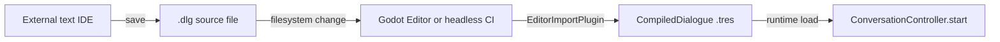

# External IDE Authoring Workflow

v1 ships an **import plugin only** (D18.1). Authors write `.dlg` dialogue in an external text editor; Godot compiles sources to `CompiledDialogue` `.tres` on reimport (D1.3, D18.3).

Architecture references: [ADR-012 Validation, Tooling and Testing](../../../../docs/architecture/dialogue/decisions/012-validation-tooling-testing.md), [ADR-013 Future Editor](../../../../docs/architecture/dialogue/decisions/013-future-editor.md), [02-authoring-format.md](../../../../docs/architecture/dialogue/02-authoring-format.md).

---

## Workflow (D18.3)



1. **Enable the addon** — Project → Project Settings → Plugins → **Dialogue Framework**.
2. **Author in your IDE** — Create or edit `*.dlg` under the project `res://` tree (VS Code, Cursor, Zed, etc.).
3. **Save the file** — `.dlg` text is the **canonical source** (D19.2); the compiler does not mutate authoring semantics.
4. **Reimport in Godot** — Focus the editor or use **Project → Reload Current Project** so the `DlgImportPlugin` runs. Errors appear in the **Import** tab and editor console (D18.4).
5. **Reference compiled output** — Point game code at the generated `.tres` (or rely on Godot’s imported resource path).

There is **no visual dialogue editor** and **no in-editor playtest panel** in v1 (D18.1, D19.1, D19.4). Validation is import-time plus automated tests (D16.1).

---

## What ships in the addon (D18.1)

| Shipped | Not shipped |
|---------|-------------|
| `DlgImportPlugin` (`.dlg` → `.tres`) | Visual graph / WYSIWYG dialogue editor |
| ProjectSettings manifest paths | In-editor playtest button |
| Headless `compile_all_dlg.gd` for CI | Alternate authoring formats (JSON/Yarn/etc.) |

---

## ProjectSettings for validation

Configure under **Project → Project Settings → Dialogue Framework**:

| Key | Purpose |
|-----|---------|
| `dialogue_framework/flag_manifest_path` | `FlagManifest` — required for `--strict` CI |
| `dialogue_framework/command_manifest_path` | `CommandManifest` — required when using game `@commands` |
| `dialogue_framework/compile_processor_path` | Optional advanced hook (D17.3) |

**Local editor import** warns and skips some checks when manifests are missing. **CI `--strict`** treats missing manifests as errors (D15.3).

---

## CI compile-all (D18.2, D15.4)

Headless validation of every `.dlg` in the project:

```bash
godot --headless --path . \
  --script res://addons/dialogue_framework/tools/compile_all_dlg.gd
```

Strict tier (manifests required, tiered validation errors):

```bash
godot --headless --path . \
  --script res://addons/dialogue_framework/tools/compile_all_dlg.gd -- --strict
```

Exit codes:

| Code | Meaning |
|------|---------|
| `0` | All `.dlg` files compiled |
| `1` | One or more compile errors |
| `2` | Usage error |

Configure `FlagManifest` and `CommandManifest` paths before enabling `--strict` in CI.

---

## Troubleshooting import errors (D18.4)

| Symptom | Check |
|---------|--------|
| Import tab shows compile error | Open **Import** dock → select `.dlg` → read error list |
| Unknown `@command` | Add to `CommandManifest` or use built-ins (`wait`, `set_flag`, `emit`) |
| Unknown `flag("...")` | Add flag to `FlagManifest` or configure manifest path |
| Invalid `=>` target | Target title must exist in the same `.dlg` file (no cross-file imports, D5.5) |
| `#portrait` rejected | Portraits deferred in v1 (D11.4) |

Syntax reference: [02-authoring-format.md](../../../../docs/architecture/dialogue/02-authoring-format.md).

---

## Related guides

- [../README.md](../README.md) — Addon setup and architecture index
- [game_presenter.md](game_presenter.md) — Runtime presenter contract
- [game_command_integration.md](game_command_integration.md) — Game `@command` handlers
