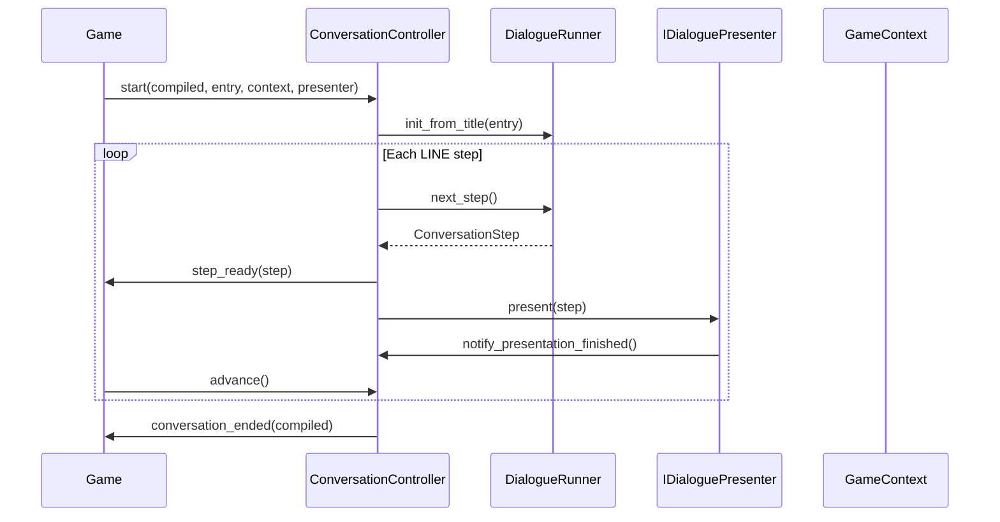

# Architecture Overview

**Decisions:** D1.2, D2.1–D2.6, subsystem responsibilities table

---

## Layered runtime

Diagram shows **LINE-step flow only** (D2.5). Other step kinds do not use a universal `notify_presentation_finished()` path:

- **LINE:** presenter calls `notify_presentation_finished()`; game calls `advance()` (D2.5, D6.2).
- **CHOICES:** controller waits for `choose()` (D6.9).
- **COMMAND:** controller auto-`advance()` after handler (D6.8).
- **WAIT:** controller auto-`advance()` after timer (D6.5).

After the runner yields a step, the controller **emits `step_ready(step)`**, then calls **`presenter.present(step)`** (D2.5). The game may listen to signals or call controller methods directly.

---

## ConversationController (D2.1)

Public autoload API for starting, advancing, and ending conversations.

| Method | Description |
|--------|-------------|
| `start(compiled, entry, context, presenter) -> bool` | Begin conversation at `entry` title. Returns `false` + `push_warning` if not `Idle` (D2.4). |
| `advance() -> void` | Progress to next step after presentation complete. |
| `choose(option_index: int) -> void` | Select choice; valid only in `AwaitingChoice` (D6.9). |
| `cancel() -> void` | Hard cancel; does not await in-flight async commands (D6.7). |
| `resume(snapshot, context, presenter) -> void` | Resume from `DialogueSnapshot` (D12.x). |
| `notify_presentation_finished() -> void` | Called by presenter when ready for advance. |
| `get_debug_state() -> Dictionary` | Debug introspection (D14.4). |

| Signal | Payload |
|--------|---------|
| `step_ready` | `step: ConversationStep` |
| `conversation_ended` | `compiled: CompiledDialogue` |
| `conversation_cancelled` | — |
| `command_executed` | `command_name: String`, `args: Array` |

---

## DialogueRunner (D2.2)

Pure traversal engine. No UI or scene tree references.

| Method | Description |
|--------|-------------|
| `load(compiled: CompiledDialogue) -> void` | Load compiled resource. |
| `init_from_title(title: String) -> void` | Set cursor to title entry line. |
| `set_cursor(line_id: String) -> void` | Jump cursor (resume, choice target). |
| `next_step() -> ConversationStep \| null` | Evaluate conditions, skip structural nodes, yield next step. |
| `peek_step_kind() -> ConversationStepKind` | Inspect upcoming step without advancing. |

---

## Conversation phases (D2.3)

| Phase | Entered when |
|-------|--------------|
| `Idle` | Initial / after cleanup |
| `PresentingLine` | `start()` or after `choose()` targets a line |
| `AwaitingInput` | Presenter calls `notify_presentation_finished()` on LINE |
| `AwaitingChoice` | `advance()` yields CHOICES → `present(CHOICES)` (D6.9) |
| `ExecutingCommand` | `advance()` yields COMMAND (D6.8) |
| `Ended` | END step, cancel, error, or zero visible choices |

**Transitions:**

- `Idle` → `PresentingLine` on `start()`
- `PresentingLine` → `AwaitingInput` on `notify_presentation_finished()`
- `AwaitingInput` → `PresentingLine` on `advance()` when next is LINE
- `AwaitingInput` → `AwaitingChoice` on `advance()` when next is CHOICES
- `AwaitingInput` → `ExecutingCommand` on `advance()` when next is COMMAND
- `AwaitingInput` → `Ended` on `advance()` when next is null/END
- `AwaitingChoice` → `PresentingLine` on `choose()`
- `ExecutingCommand` → same outcomes as `AwaitingInput` on auto-`advance()` after handler
- Any active → `Ended` on `cancel()`
- `Ended` → `Idle` after cleanup

---

## Component responsibilities

See [README.md](README.md#subsystem-overview) for the full subsystem diagram and responsibility table.

---

## Package layout (D2.6)

All framework code lives under `addons/dialogue_framework/`.

---

## Related documents

- [04-runtime-and-integration.md](04-runtime-and-integration.md) — Detailed execution flows
- [decisions/002-runtime-architecture.md](decisions/002-runtime-architecture.md) — ADR
