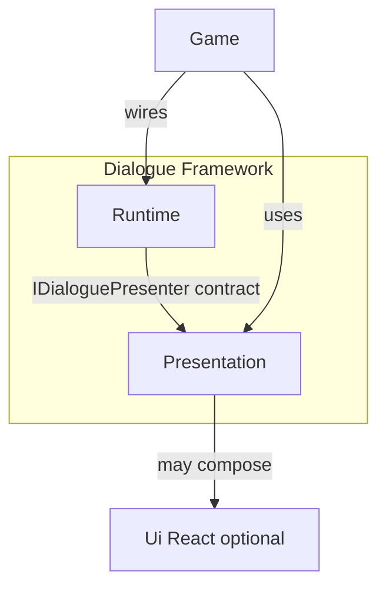

# Presentation Product Specification v1

**Status:** Frozen — authoritative product baseline  
**Version:** 1  
**Authority:** Subordinate to ADR-014, ADR-010, ADR-001; does not modify accepted architecture  
**Purpose:** Define what Presentation is as a product, who owns what, and how consumers use it  
**Not in scope:** Implementation mechanics, folder structure, class design, or ADR text  
**Evolution:** Future architectural changes proceed through ADRs, not edits to this document

**Normative ADRs derived from this specification:** [015](decisions/015-presentation-product-concepts.md) · [016](decisions/016-presentation-input-ownership.md) · [017](decisions/017-presentation-accessibility.md) · [018](decisions/018-presentation-consumer-customization.md) · [019](decisions/019-presentation-growth-constraints.md)

---

## 1. Purpose

This specification answers:

> **What is Presentation as a product?**

It does not answer how Presentation is built.

Presentation is the Dialogue Framework subsystem that makes dialogue **visible, readable, and interactable** on screen. It is a first-class product alongside Runtime—not a demo concern, not a game concern, and not part of Ui React.

---

## 2. Product Position

| Product | One-line role |
|---------|---------------|
| **Runtime** | Runs conversations |
| **Presentation** | Displays conversations |
| **Ui React** | Provides generic UI infrastructure (optional) |
| **Game** | Provides game rules, content, and orchestration |

---

## 3. What Presentation Is

### Presentation provides

- Dialogue display (speaker, line text, choices, future layout styles)
- Dialogue UX behavior (typewriter, tag timing, voice playback, text overflow, choice interaction)
- Visual identity for dialogue (themes)
- Reference layout scenes consumers duplicate and customize
- Dialogue accessibility behavior
- Dialogue UX input handling (default path)
- Optional use of Ui React at the individual control level

### Presentation does not provide

- Dialogue execution, traversal, branching, or phase logic
- Game state, commands, or content
- Generic UI infrastructure
- A second dialogue runtime

---

## 4. Ownership Boundaries

| Subsystem | Owns | Must not own |
|-----------|------|--------------|
| **Runtime** | Dialogue execution, `ConversationStep`, `IDialoguePresenter` interface | UI, themes, layouts, typewriter, tag interpretation, accessibility presentation |
| **Presentation** | Display, behavior, themes, layouts, timing, tags, voice, dialogue a11y, dialogue UX input (default), reference implementations | Graph traversal, game state, command execution |
| **Ui React** | Generic bindings, animations, reactive UI states | Dialogue semantics or Runtime concepts |
| **Game** | `GameContext`, commands, when conversations run, gameplay pause, applying player settings to Presentation resources | Reusable dialogue presentation technology |

**Core invariant:** Runtime never depends on Presentation. Presentation may depend on Runtime. Ui React remains optional. Game orchestrates but does not own reusable dialogue UI technology.

> **Localization note (ADR-020 D26.16, ADR-022 D28.6):** Line body text and choice option labels arrive on `ConversationStep` **already localized by Runtime**. Presentation displays these strings and must not perform translation-catalog lookup for line body or choice labels, nor traverse `CompiledDialogue`. Presentation resolves only the **speaker display name** via `tr(speaker_id, "speakers")` — the single Presentation translation-resolution case. This clarifies the ownership boundaries above and does not change the product model or the `IDialoguePresenter` contract (unchanged for v1, ADR-022 D28.18).

---

## 5. Editor-Facing Concepts

Presentation exposes **four composable concepts** consumers mix independently:

| Concept | Owns | Consumer customizes via |
|---------|------|-------------------------|
| **Layout** | Structure and composition: where speaker, line, and choices appear; screen positioning; panel composition; optional motion | Duplicate a layout scene; edit in Godot scene editor |
| **Theme** | Visual identity only | Duplicate a Theme resource; edit in Inspector |
| **Policy** | Behavior and timing only | Duplicate a Policy resource; edit in Inspector |
| **Input** | Dialogue UX input mapping | Duplicate an Input resource; edit in Inspector |

### Theme and Policy are distinct (architectural decision)

- **Theme** controls how dialogue looks.
- **Policy** controls how dialogue behaves.
- Timing, typewriter, tag interpretation, and overflow rules belong to **Policy**, not Theme.
- Colors, fonts, spacing, and choice chrome belong to **Theme**, not Policy.
- **Borderline rule:** structural dimensions are Theme; interaction semantics are Policy.

### Integration concept (architectural, not a customization surface)

- **Presenter** is the Runtime integration point implementing `IDialoguePresenter`.
- Reference layouts include a pre-wired presenter.
- Consumers customize through Layout, Theme, Policy, and Input—not by rewriting presenter logic.

### Layout is the primary customization surface (architectural decision)

- The consumer-facing product unit is a **dialogue layout scene**.
- Onboarding message: *"Duplicate a dialogue HUD layout scene."*
- The presenter is infrastructure inside that scene, not the primary thing consumers author.

---

## 6. Layout Product Model

### What a layout is

A **layout** is a complete dialogue HUD scene defining:

- Where dialogue regions exist on screen
- How speaker, line, and choice areas are composed
- How the presenter and default input handling attach to those regions

### What consumers do with layouts

- Instance or duplicate a reference layout
- Reposition panels (e.g. choices below, beside, or above the dialogue box)
- Adjust anchors, sizing, and safe areas in the scene editor
- Choose among **reference layout variants** for common patterns
- Mix native Godot UI and Ui React controls within the same layout where helpful

### Layout slot convention (architectural decision)

Every layout must provide identifiable regions for:

- Speaker display
- Line text display
- Choice list
- Line visibility area
- Choice visibility area

Consumers may rearrange visual composition but must preserve the layout's ability to connect these regions to Presentation. Portrait display is reserved for a future architectural decision; not required in v1.

### Native baseline requirement

At least one reference layout must function **without Ui React installed**. This satisfies the architectural requirement that Presentation works with native Godot UI alone.

### Reference layout variants

Multiple reference layouts (e.g. choices-below, choices-right) are **product content**, not separate architectural paths. v1 may ship a subset; the product model treats variants as first-class.

---

## 7. Ui React Relationship

**Mixed composition (architectural decision)** — not two exclusive product paths.

- Presentation is one product.
- Layouts may freely mix native Godot UI and Ui React controls per widget.
- Ui React is optional enhancement where it adds value (binding, animation)—not a required commitment.
- Theme, Policy, and Input resources are shared regardless of which controls a layout uses.
- Ui React never gains dialogue knowledge.
- Presentation never requires Ui React.

---

## 8. Input Ownership

**Split + configurable (architectural decision)**

| Owner | Responsibility |
|-------|----------------|
| **Presentation (default)** | Dialogue UX input: skip typewriter, advance line, navigate and confirm choices |
| **Input concept** | Configurable mapping from player actions to dialogue UX commands |
| **Game** | When conversations start and stop; pausing gameplay; optionally overriding or disabling default presentation input when other UI systems compete |

For the common case, Game does **not** reimplement skip, advance, or choice navigation logic. That is reusable presentation technology owned by Presentation.

See [decisions/016-presentation-input-ownership.md](decisions/016-presentation-input-ownership.md).

---

## 9. Policy Scope

Policy owns all dialogue presentation **behavior**, including:

- Typewriter and reveal behavior
- Reduced motion behavior (including skipping typewriter)
- Interpretation of dialogue tags (`#voice`, `#time`, `#time=auto`)
- Choice interaction rules (navigation, confirmation behavior)
- Text overflow behavior (grow, clamp, or scroll)
- Optional selection of an alternate Theme under accessibility conditions

Policy does **not** own visual styling or structural layout positioning.

---

## 10. Theme Scope

Theme owns all dialogue presentation **appearance**, including:

- Speaker and line typography and color
- Panel and banner styling
- Choice visual states (normal, hover, focus, selected)
- Spacing and dimensional styling tokens
- Accessibility visual variants (high contrast, large text)

Theme does **not** own timing, typewriter speed, tag behavior, or input bindings.

---

## 11. Accessibility

**Presentation owns dialogue accessibility (architectural decision).**

| Accessibility need | Owned by |
|--------------------|----------|
| Reduced motion / skip typewriter | Policy |
| High contrast and large text | Theme variants |
| Choice focus visibility | Theme |
| Choice keyboard navigation | Input + Presentation default handling |
| Screen reader / narration pipeline | Out of v1 product scope; future ADR |

Ui React may optionally enhance control-level focus or animation where used. It does not replace Presentation's dialogue accessibility responsibilities.

Game applies player settings by selecting appropriate Policy and Theme resources—this is orchestration, not presentation implementation.

See [decisions/017-presentation-accessibility.md](decisions/017-presentation-accessibility.md).

---

## 12. Internal Responsibilities (Not Consumer-Facing)

Presentation contains internal coordination responsible for:

- Sequencing line reveal and completion signaling to Runtime
- Interpreting presentation tags on `ConversationStep`
- Managing choice presentation and selection handoff to Runtime
- Applying Policy and Theme during active conversations
- Cancelling in-progress presentation when conversations change or dismiss

Consumers do not author or replace this coordination for normal customization. It exists so Layout, Theme, Policy, and Input remain editor-first product concepts.

---

## 13. Scripting Boundary

### Does not require scripting (normal path)

- Duplicating or instancing a reference layout scene
- Editing layout structure in the Godot scene editor
- Duplicating and assigning Theme, Policy, and Input resources
- Mixing native and Ui React controls within a layout
- Wiring the layout's presenter into `ConversationController.start()`

### Requires scripting (escape hatch)

| Need | Approach |
|------|----------|
| Non-standard dialogue display (world-space, 3D, custom widget systems) | Custom `IDialoguePresenter` implementation |
| Input arbitration with competing UI layers | Override or disable default presentation input; route from Game |
| Conversation lifecycle | Game orchestration (start, cancel, pause player) |
| Applying player settings | Game selects Policy/Theme resources |
| Layout topology outside the slot convention | Custom layout and custom presenter |

### Not a supported customization path

- Subclassing or modifying reference presenter logic to change appearance, timing, choice position, or anchors

See [decisions/018-presentation-consumer-customization.md](decisions/018-presentation-consumer-customization.md).

---

## 14. Consumer Experience

### Minimum setup

1. Add a native reference layout scene to the game
2. Start conversations by passing the layout's presenter to Runtime

### Recommended setup

1. Duplicate the closest reference layout variant
2. Duplicate Theme and Policy resources; assign them in the Inspector
3. Adjust visually; play

### Advanced customization

- Rearrange dialogue regions in the layout scene
- Use mixed native and Ui React controls
- Create custom Input resources for rebinding
- Provide Theme variants for accessibility

### Extension

- Implement `IDialoguePresenter` for dialogue displays outside the reference layout model
- Override presentation input when the default handling is insufficient

---

## 15. Editor Workflow

Presentation follows an editor-first workflow parallel to Ui React's product philosophy:

**Scene + resources + Inspector — not scripts.**

| Goal | Workflow |
|------|----------|
| Change visual style | Duplicate Theme; assign in Inspector |
| Change dialogue pacing and feel | Duplicate Policy; assign in Inspector |
| Move choices or reposition dialogue | Duplicate layout variant or edit layout scene |
| Handle long text | Set Policy overflow behavior; adjust layout sizing |
| Add motion to panels | Configure motion in the layout scene (native or Ui React where used) |
| Rebind dialogue keys | Duplicate Input resource |
| Use Ui React for specific widgets | Place Ui React controls in layout slots; keep layout regions connected |
| Enable reduced motion or large text | Game applies accessibility Policy and/or Theme variant |

---

## 16. Relationship to Dialogue Framework

| Question | Answer |
|----------|--------|
| What does Presentation provide? | Display, behavior, themes, layouts, input defaults, reference implementations |
| What does a game developer customize? | Layout scenes, Theme, Policy, Input |
| What requires scripting? | Orchestration, escape-hatch presenters, input override |
| What does not require scripting? | Visual style, pacing, layout, rebinding, standard subtitle dialogue |
| How does Presentation fit? | Optional subsystem of Dialogue Framework; wired into Runtime via `IDialoguePresenter` |
| How does it grow? | New Presentation assets; Runtime changes only through future ADRs |

---

## 17. Long-Term Product Direction

**Growth model (architectural decision):** Presentation evolves by adding assets—layouts, themes, policies—not by expanding Runtime responsibilities.

| Future capability | Product landing zone |
|-------------------|---------------------|
| New dialogue styles (VN, balloon, RPG box) | New layout scenes and variants |
| Portraits | Future ADR; then layout regions and Theme |
| New presentation tags | Policy |
| Richer motion | Layout scene configuration |
| Expanded accessibility | Policy and Theme variants |

Runtime and `ConversationStep` change only when a future ADR explicitly requires it (e.g. portraits).

See [decisions/019-presentation-growth-constraints.md](decisions/019-presentation-growth-constraints.md).

### v1 product surface

Aligned with ADR-001 YAGNI:

- Subtitle-style layouts only
- One native-only reference layout minimum; one or two layout variants
- Core Theme, Policy (including overflow and reduced motion), and Input defaults
- No portraits

See [addons/dialogue_framework/presentation/reference-content-v1.md](../../../addons/dialogue_framework/presentation/reference-content-v1.md) for the v1 reference content scope.

---

## 18. Verification Expectations (Product Level)

- Runtime remains testable without Presentation scenes
- Presentation is verifiable through layout-based integration scenarios
- Architectural boundaries (Runtime independence, optional Ui React, native baseline) remain enforceable as product guarantees

---

## 19. Success Statement

Presentation Product Specification v1 is satisfied when a developer can describe the product as:

> **Runtime** runs conversations. **Presentation** displays them—I duplicate a layout scene, edit Theme and Policy resources, and rearrange panels if I want. **Ui React** helps on specific controls when I choose. **Game** starts conversations and pauses the player.

Every responsibility has one owner. Dependencies flow one way. New dialogue styles are new Presentation assets—not Runtime changes.

---

## 20. Settled Decision Record

| # | Architectural / product decision |
|---|----------------------------------|
| 1 | Four composable editor-facing concepts: Layout, Theme, Policy, Input |
| 2 | Layout scenes are the primary consumer customization surface |
| 3 | Theme and Policy are strictly distinct |
| 4 | Mixed native and Ui React composition; not exclusive paths |
| 5 | Presentation owns dialogue UX input by default; Game may override |
| 6 | Presentation owns dialogue accessibility |
| 7 | Presenter is Runtime integration infrastructure, not a customization tier |
| 8 | Layout slot convention for required dialogue regions |
| 9 | Reference layout variants and Policy overflow behavior are in scope |
| 10 | Growth via Presentation assets; Runtime changes only via future ADRs |

---

*End of Presentation Product Specification v1*
