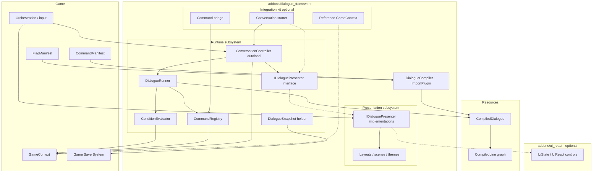

# Dialogue Framework Architecture

Custom Godot dialogue framework for a MegaMan Legends–style 3D action RPG. This documentation set is generated from the frozen Architecture Decision Log (AD workshop, 2026-07), amended by ADR-014 (2026-07-07) and the localization contract ADRs 020–022 (2026-07-11).

**Package path:** `addons/dialogue_framework/` (D2.6)

**Product structure:** Runtime + optional Presentation + optional Integration — see [06-product-structure.md](06-product-structure.md).

**Research context:** Design informed by reverse-engineering [Dialogic 2](research/00-research-summary.md) and [Dialogue Manager](research/00-research-summary.md) in this repository. Neither plugin is modified or adopted wholesale.

---

## Documentation index

| Document | Description |
|----------|-------------|
| [00-project-goals.md](00-project-goals.md) | Goals, v1 scope, and non-goals |
| [01-architecture-overview.md](01-architecture-overview.md) | Layered runtime, phases, subsystem diagram |
| [02-authoring-format.md](02-authoring-format.md) | `.dlg` syntax, conditions, commands, tags |
| [03-compilation-and-data.md](03-compilation-and-data.md) | CompiledDialogue schema, import pipeline, manifests |
| [04-runtime-and-integration.md](04-runtime-and-integration.md) | Execution flow, GameContext, presenter, commands |
| [05-open-questions.md](05-open-questions.md) | Deferred work (no open architecture blockers) |
| [06-product-structure.md](06-product-structure.md) | Runtime vs Presentation vs Integration, dependency rules |
| [07-presentation-product-spec.md](07-presentation-product-spec.md) | **Presentation Product Specification v1** (frozen) |
| [decisions/](decisions/) | Architecture Decision Records (ADRs) |
| [../../../dag.md](../../../dag.md) | Implementation DAG index (active: ADR-024 Integration kit) |

---

## Subsystem overview

| Component | Responsibility | Must NOT |
|-----------|----------------|----------|
| **DialogueCompiler** | Parse `.dlg` → `CompiledDialogue`; validate; tokenize | Touch game state or UI |
| **CompiledDialogue** | Immutable graph + titles + metadata | Execute or display |
| **DialogueRunner** (Runtime) | Traverse graph; evaluate conditions; emit `ConversationStep` | Instantiate scenes; call game except via context/registry |
| **ConditionEvaluator** (Runtime) | Interpret token arrays against `GameContext` | Arbitrary autoload access |
| **CommandRegistry** (Runtime) | Dispatch `@commands`; async support | Parse `.dlg` text |
| **ConversationController** (Runtime) | Public API; phase state; wire presenter; signals | Own persistent game state; implement presentation |
| **`IDialoguePresenter` interface** (Runtime) | Contract: `present`, `dismiss` | Implement dialogue HUD (implementations live in Presentation) |
| **Presentation subsystem** | Implement presenters; typewriter; tags; layouts; themes | Traverse graph; mutate flags; depend on Ui React as required |
| **Integration kit** (optional) | Starter Node, reference `GameContext`, command bridge | Import Presentation; own catalogs/save; expand Runtime contracts |
| **GameContext** (game) | Flags, items, quests, bindings | Parse or traverse dialogue |
| **Game orchestration** (game) | Wire presenter, pause player, route input (or via Integration) | Own reusable presentation technology (unless overriding) |
| **Ui React** (optional) | Generic reactive UI | Dialogue concepts, Runtime types |
| **DialogueSnapshot** (Runtime helper) | Serialize/deserialize resume coordinates | Replace game save |
| **FlagManifest** (game) | Declare valid flags and `{brace}` keys for compile validation | Runtime execution |
| **CommandManifest** (game) | Declare valid game `@command` names for compile validation | Runtime execution; not `CommandRegistry` |

---

## Quick reference

### ConversationController API (D2.1)

**Methods:** `start(compiled, entry, context, presenter) -> bool` · `advance()` · `choose(option_index)` · `cancel()` · `resume(snapshot, context, presenter)` · `notify_presentation_finished()` · `get_debug_state() -> Dictionary`

**Signals:** `step_ready(step)` · `conversation_ended(compiled)` · `conversation_cancelled()` · `command_executed(command_name, args)`

### Conversation phases (D2.3)

`Idle` → `PresentingLine` → `AwaitingInput` → (`AwaitingChoice` | `ExecutingCommand` | next line | `Ended`)

### ADR index

See [decisions/](decisions/) for full records. Clusters: philosophy (001), runtime (002), data model (003), authoring (004), compilation (005), execution (006), commands (007), conditions/state (008), game integration (009), UI (010), save/i18n/debug (011), validation/tooling (012), future editor (013), product structure (014), **presentation product (015–019)**, **localization (020 subsystem model, 021 compile-time identity contract, 022 runtime delivery and locale switching, 023 AwaitingChoice co-visible LINE refresh)**, **optional Integration kit ([ADR-024](decisions/024-optional-game-integration-kit.md) Accepted)**.

Presentation product baseline: [07-presentation-product-spec.md](07-presentation-product-spec.md).

---

## Architecture change gate (D25.2)

Per [ADR-019 Presentation Growth Constraints](decisions/019-presentation-growth-constraints.md) **D25.2**, changes to the following Runtime contracts or schemas require an **explicit future ADR** before implementation:

- `ConversationStep` DTO
- `CompiledLine` / `CompiledDialogue` schema
- `ConversationPhase` state machine
- `IDialoguePresenter` interface

Do not extend these types, add fields, or add presenter callbacks without a new accepted ADR. Presentation grows through layout scenes and Theme, Policy, and Input resources (D25.1); Runtime responsibilities do not expand to absorb presentation features.

Deferred expansions that trigger this gate are tracked in [05-open-questions.md](05-open-questions.md).

### Localization contracts authorized under this gate

The accepted localization contract ADRs authorize D25.2-gated changes for localization (implementation still requires explicit change-gate authorization):

- `CompiledLine` / `CompiledDialogue` — choice-label translation identity binding and version signaling ([ADR-021](decisions/021-localized-authoring-compiled-identity.md) D27.18)
- `ConversationStep` — localized LINE body + choice-label delivery semantics ([ADR-022](decisions/022-localized-runtime-delivery-locale-switching.md) D28.18)
- `ConversationPhase` — `AwaitingChoice` locale refresh and remaining per-phase guarantees ([ADR-022](decisions/022-localized-runtime-delivery-locale-switching.md) D28.18)

`IDialoguePresenter` is **not** implicated for v1 choice/LINE `present(step)` delivery ([ADR-022](decisions/022-localized-runtime-delivery-locale-switching.md) D28.18). **ADR-023** authorizes the narrow `refresh_line_text` contract for co-visible prompting LINE refresh during `AwaitingChoice`.
