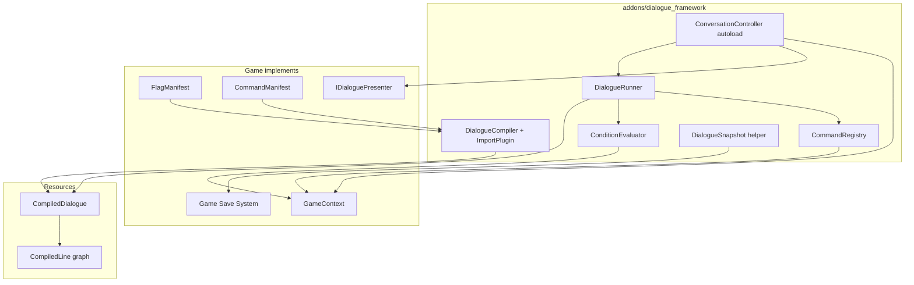

# Dialogue Framework Architecture

Custom Godot dialogue framework for a MegaMan Legends–style 3D action RPG. This documentation set is generated from the frozen Architecture Decision Log (AD workshop, 2026-07).

**Package path:** `addons/dialogue_framework/` (D2.6)

**Research context:** Design informed by reverse-engineering [Dialogic 2](research/00-research-summary.md) and [Dialogue Manager](research/00-research-summary.md) in this repository. Neither plugin is modified or adopted wholesale.

---

## Documentation index

| Document | Description |
|----------|-------------|
| [00-project-goals.md](00-project-goals.md) | Goals, v1 scope, and non-goals |
| [01-architecture-overview.md](01-architecture-overview.md) | Layered runtime, phases, subsystem diagram |
| [02-authoring-format.md](02-authoring-format.md) | `.dlg` syntax, conditions, commands, tags |
| [03-compilation-and-data.md](03-compilation-and-data.md) | CompiledDialogue schema, import pipeline, manifests |
| [04-runtime-and-integration.md](04-runtime-and-integration.md) | Execution flow, GameContext, presenter, commands |
| [05-open-questions.md](05-open-questions.md) | Deferred work (no open architecture blockers) |
| [decisions/](decisions/) | Architecture Decision Records (ADRs) |

---

## Subsystem overview

| Component | Responsibility | Must NOT |
|-----------|----------------|----------|
| **DialogueCompiler** | Parse `.dlg` → `CompiledDialogue`; validate; tokenize | Touch game state or UI |
| **CompiledDialogue** | Immutable graph + titles + metadata | Execute or display |
| **DialogueRunner** | Traverse graph; evaluate conditions; emit `ConversationStep` | Instantiate scenes; call game except via context/registry |
| **ConditionEvaluator** | Interpret token arrays against `GameContext` | Arbitrary autoload access |
| **CommandRegistry** | Dispatch `@commands`; async support | Parse `.dlg` text |
| **ConversationController** | Public API; phase state; wire presenter; signals | Own persistent game state |
| **GameContext** (game) | Flags, items, quests, bindings | Parse or traverse dialogue |
| **IDialoguePresenter** (game) | Render steps; typewriter; voice; input | Traverse graph or mutate flags directly |
| **DialogueSnapshot** (helper) | Serialize/deserialize resume coordinates | Replace game save |
| **FlagManifest** (game) | Declare valid flags and `{brace}` keys for compile validation | Runtime execution |
| **CommandManifest** (game) | Declare valid game `@command` names for compile validation | Runtime execution; not `CommandRegistry` |

---

## Quick reference

### ConversationController API (D2.1)

**Methods:** `start(compiled, entry, context, presenter) -> bool` · `advance()` · `choose(option_index)` · `cancel()` · `resume(snapshot, context, presenter)` · `notify_presentation_finished()` · `get_debug_state() -> Dictionary`

**Signals:** `step_ready(step)` · `conversation_ended(compiled)` · `conversation_cancelled()` · `command_executed(command_name, args)`

### Conversation phases (D2.3)

`Idle` → `PresentingLine` → `AwaitingInput` → (`AwaitingChoice` | `ExecutingCommand` | next line | `Ended`)

### ADR index

See [decisions/](decisions/) for full records. Clusters: philosophy (001), runtime (002), data model (003), authoring (004), compilation (005), execution (006), commands (007), conditions/state (008), game integration (009), UI (010), save/i18n/debug (011), validation/tooling (012), future editor (013).
