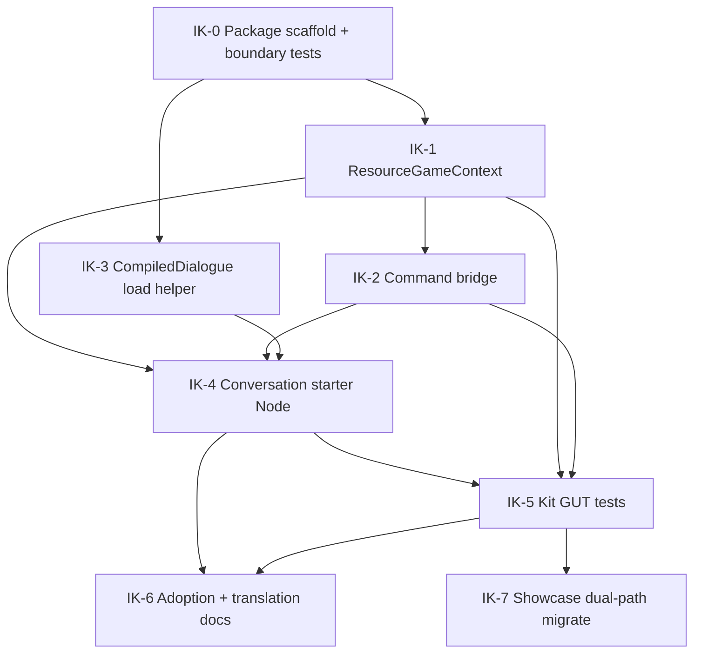

# ADR-024 Integration Kit — Implementation Plan (D30.4)

**Status:** Complete — IK-0 through IK-7 implemented; showcase uses kit (editor-wired starter).  
**Authorizes:** ADR-024 D30.4 / D30.9 kit surfaces only  
**Does not authorize:** D25.2 Runtime contract changes (`IDialoguePresenter`, `ConversationStep`, phases, compiled schemas)  
**ADR:** [../decisions/024-optional-game-integration-kit.md](../decisions/024-optional-game-integration-kit.md)  
**Project DAG index:** [../../../dag.md](../../../dag.md)

---

## Goal

Ship an optional `addons/dialogue_framework/integration/` package that reduces game-boundary script tax for:

1. Resource / dictionary-backed `GameContext` (reference impl)
2. Command bridge Resource + registrar
3. Conversation starter Node
4. Thin `CompiledDialogue` load helper (placement: prefer `integration/`)
5. Docs: kit adoption + Godot-native translation workflow (primary i18n story)

Showcase migration (IK-7) is **complete**; demo thin wrappers were removed in favor of kit APIs (`CompiledDialogueLoader`, scene-wired `ConversationStarter`).

---

## Non-goals (reject in review if proposed)

- Runtime importing Integration or Presentation
- Integration importing `presentation/` or Ui React
- Kit-owned translation catalogs or locale policy
- Kit-owned authoritative save / flags as game SOT
- Framework shop / cutscene / camera / anim implementations (hooks only)
- Expanding presenter / step / phase contracts
- Making showcase JSON catalogs the primary product story

---

## Dependency DAG

Stable local IDs (`IK-*`) are the planning source of truth. Linear issue IDs are filled when the Remaining Work epic is created (see [docs/dag.md](../../../dag.md)).



| ID | Work package | Blocked by | Blocks |
|----|--------------|------------|--------|
| **IK-0** | Create `integration/` package; plugin/docs visibility; **boundary tests** (Runtime has zero `integration/` / `presentation/` refs; Integration has zero `presentation/` refs) | — | IK-1, IK-3 |
| **IK-1** | Resource/dictionary-backed `GameContext` reference implementation | IK-0 | IK-2, IK-4, IK-5 |
| **IK-2** | Command bridge Resource + registrar (context methods + game-mode hooks) | IK-1 | IK-4, IK-5 |
| **IK-3** | Thin `CompiledDialogue` load helper | IK-0 | IK-4 |
| **IK-4** | Conversation starter Node (exports + `ConversationController` only) | IK-1, IK-2, IK-3 | IK-5, IK-6 |
| **IK-5** | Kit-focused GUT tests (separate from Runtime headless gate) | IK-4 (+ IK-1/IK-2 surfaces under test) | IK-6, IK-7 |
| **IK-6** | Developer docs: kit adoption path + Godot CSV/`.translation` workflow; optional thin registrar note | IK-4, IK-5 | — |
| **IK-7** | Showcase on kit; panel/smoke demo-owned | IK-5 | — |

**Critical path:** IK-0 → IK-1 → IK-2 → IK-4 → IK-5 → IK-6  
**Parallelizable:** IK-3 with IK-1; docs draft can start after IK-4 API is sketched.

---

## Work package details

### IK-0 — Package scaffold + boundary tests

**Deliverables**

- `addons/dialogue_framework/integration/` directory with README stub (purpose, invariants, “optional”).
- Ensure addon packaging does not force Integration load for headless Runtime tests.
- Automated boundary check (GUT or existing structure test):
  - No `runtime/` file references `integration/` or `presentation/`
  - No `integration/` file references `presentation/` or `ui_react`

**Acceptance**

- [ ] Directory exists and is documented as optional
- [ ] Runtime headless GUT suite still passes without requiring Integration scripts to load for core tests
- [ ] Boundary assertions green

**Showcase mapping:** none yet

---

### IK-1 — Resource / dictionary-backed `GameContext`

**Deliverables**

- `integration/` Resource (or Resource + thin class) implementing `GameContext` (D10.1) via Inspector-authored maps (flags, items, quests, display values, bindings).
- Explicit documentation on the type: **not** authoritative game save (D1.1).
- Subclass / replace escape hatch remains valid (D30.6).

**Design constraints**

- Prefer Godot `@export` dictionaries / typed Resources over code-only setup.
- No Persistence API; no autoload save coupling.
- Mirror showcase behavior only where it is generic (`ShowcaseGameContext`); leave showcase-specific display sync helpers to the demo or a subclass.

**Acceptance**

- [ ] Satisfies abstract `GameContext` methods
- [ ] Can be authored in Inspector without a custom script for the happy path
- [ ] Unit tests cover get/set flag, items, quests, display, bindings
- [ ] Docs state save-authority boundary

**Showcase mapping:** `showcase_game_context.gd` → kit reference or thin demo subclass

---

### IK-2 — Command bridge

**Deliverables**

- Resource describing mappings from `@command` names to:
  - **Context methods** (e.g. `start_quest`, `give_item`, …), and/or
  - **Hooks** (Callable / signal exports) for game-mode commands (`open_shop`, `cutscene`, `camera`, `anim`)
- Registrar that calls existing `CommandRegistry.register` only (no registry contract change).

**Design constraints**

- Must not implement shop/cutscene/camera/anim bodies (D10.2–D10.3, D30.5).
- Games may ignore the bridge and register manually (D30.6).
- Clear error behavior when a mapped command is already registered (follow existing `CommandRegistry` semantics).

**Acceptance**

- [ ] Registers context-method commands from Resource config
- [ ] Game-mode commands invoke injected hooks only
- [ ] Tests with mock context + Callables
- [ ] No Presentation imports

**Showcase mapping:** Removed — use `CommandBridge` + `CommandBridgeRegistrar` directly.

---

### IK-3 — CompiledDialogue load helper

**Deliverables**

- Thin utility to load an imported `.dlg` / `CompiledDialogue` with structured success/error result (inspired by `ShowcaseDialogueLoader`, generalized).
- Lives under `integration/` (default) unless implementation review prefers `tools/` — decide in IK-3 PR description; do not split without reason.

**Acceptance**

- [ ] Returns compiled resource or actionable errors
- [ ] Does not compile at runtime as a product path (import remains source of truth)
- [ ] Unit-tested with fixtures / temp paths where practical

**Showcase mapping:** Removed — use `CompiledDialogueLoader` directly.

---

### IK-4 — Conversation starter Node

**Deliverables**

- Node with Inspector exports for:
  - compiled dialogue resource and/or path
  - entry title
  - presenter `NodePath` (typed as `Node` / duck-typed to `IDialoguePresenter` at runtime — **no** `presentation/` preload)
  - `GameContext` (kit Resource or custom)
  - optional command-bridge Resource
- Methods that call existing `ConversationController` APIs only (`start`, `cancel`, optionally `resume` if exports support snapshot later — **v1 minimum: start + cancel**; resume may be v1.1 if it risks scope creep).

**Design constraints**

- Sufficient for “minimal playable conversation start path” when combined with a wired presenter + compiled resource (D30.3).
- Must not own demo UI, locale toggles, or snapshot file IO (showcase keeps those).

**Acceptance**

- [ ] Inspector-configured start works in a sample/test scene
- [ ] Presenter resolved via path without importing Presentation
- [ ] Optional bridge registration occurs before `start` when configured
- [ ] Custom `GameContext` instance can replace kit context without Runtime fork

**Showcase mapping:** start/resume wiring portion of `showcase_orchestrator.gd` → starter; panel/smoke remain demo

---

### IK-5 — Kit GUT tests

**Deliverables**

- Tests under `addons/dialogue_framework/tests/` that exercise Integration surfaces.
- Document that Runtime headless suite **must not** require these tests to pass for Runtime purity (suite layout should keep Runtime-only runs possible).

**Minimum coverage**

- ResourceGameContext method surface
- Command bridge registration + hook dispatch
- Starter start/cancel with test double presenter
- Boundary / import purity (if not fully covered in IK-0)

**Acceptance**

- [ ] Kit tests green
- [ ] Runtime-only headless invocation still passes without Integration adoption
- [ ] D30.10 table properties checked (optional adoption, replaceability, catalog independence remains docs/manual for i18n)

---

### IK-6 — Docs

**Deliverables**

- Addon guide: when to use Integration vs custom wiring; package invariants.
- Godot-native translation workflow (CSV / `.translation` + Project Settings) as **primary** story (D30.8).
- Optional note: thin registrar for already-authored `Translation` resources — not Runtime catalog ownership.
- Cross-links from architecture README / `04-runtime-and-integration.md` (already partially amended on ADR Acceptance — keep in sync with final API names).

**Acceptance**

- [ ] New developer can wire starter + kit context + bridge from docs alone
- [ ] Primary i18n story does not center showcase JSON

---

### IK-7 — Showcase dual-path migrate (optional)

**Deliverables**

- Migrate showcase start/context/command wiring onto kit surfaces **or** leave dual-path with explicit comment “advanced sample”.
- Keep `showcase_panel` / smoke harness game-owned.
- JSON catalogs may remain demo-local until a separate i18n migration.

**Acceptance**

- [x] Showcase still runs
- [x] No Runtime contract changes
- [x] Demo panel remains outside kit

**As-built (IK-7):** `showcase_orchestrator.gd` wires `ConversationStarter` + `CommandBridge` + `CompiledDialogueLoader`; `ShowcaseGameContext` stays as an advanced custom-context sample; thin wrappers remain for tools; panel/smoke/locale/JSON stay demo-owned.

---

## Suggested file layout (indicative — finalize in PRs)

```text
addons/dialogue_framework/integration/
  README.md
  resource_game_context.gd          # IK-1
  command_bridge.gd                 # IK-2 Resource
  command_bridge_registrar.gd       # IK-2 (or methods on Resource)
  compiled_dialogue_loader.gd       # IK-3
  conversation_starter.gd           # IK-4
```

Exact `class_name`s are implementation choices; prefer clear, non-colliding names.

---

## Verification gates (from D30.10)

| Gate | When |
|------|------|
| Runtime GUT without Integration/Presentation load requirement | After IK-0, re-check after IK-5 |
| Sample/test scene starts via Inspector starter | IK-4 / IK-5 |
| Custom `GameContext` works with starter | IK-4 / IK-5 |
| Catalog independence (localize without Integration) | Docs IK-6 + no kit ownership of catalogs |
| Static/boundary purity | IK-0 + IK-5 |

---

## Execution order for agents

**Historical — completed 2026.** The numbered list below is retained as an archive.

1. Implement **IK-0** only first; stop for review if boundary strategy is unclear.
2. **IK-1** and **IK-3** in parallel if staffing allows.
3. **IK-2** after IK-1.
4. **IK-4** after IK-1–IK-3.
5. **IK-5** then **IK-6**.
6. **IK-7** only when explicitly prioritized (optional).

Do **not** start IK-7 before IK-5 is green.

---

## Linear sync

| Local | Linear |
|-------|--------|
| Epic | [CRG-345](https://linear.app/lock-and-key/issue/CRG-345/epic-optional-game-integration-kit-adr-024) |
| IK-0 | [CRG-346](https://linear.app/lock-and-key/issue/CRG-346/ik-0-integration-package-scaffold-boundary-tests) |
| IK-1 | [CRG-347](https://linear.app/lock-and-key/issue/CRG-347/ik-1-resourcedictionary-backed-gamecontext) |
| IK-2 | [CRG-348](https://linear.app/lock-and-key/issue/CRG-348/ik-2-command-bridge-resource-registrar) |
| IK-3 | [CRG-350](https://linear.app/lock-and-key/issue/CRG-350/ik-3-compileddialogue-load-helper) |
| IK-4 | [CRG-349](https://linear.app/lock-and-key/issue/CRG-349/ik-4-conversation-starter-node) |
| IK-5 | [CRG-351](https://linear.app/lock-and-key/issue/CRG-351/ik-5-integration-kit-gut-tests) |
| IK-6 | [CRG-353](https://linear.app/lock-and-key/issue/CRG-353/ik-6-integration-kit-adoption-translation-docs) |
| IK-7 | [CRG-352](https://linear.app/lock-and-key/issue/CRG-352/ik-7-showcase-dual-path-migrate-onto-integration-kit) |

Parent epic and children live under project **Dialogue Framework — Remaining Work**. Dependency edges are set as Linear `blockedBy` relations matching the DAG above.

`tools/crg_relations.json` / `validate_dag_sync.py` track the historical Dialogue Framework implementation ID ranges and are **not** required to include Remaining Work epics unless the Board later expands that validator on purpose.
